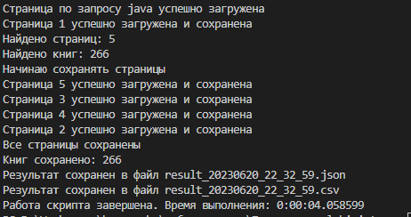
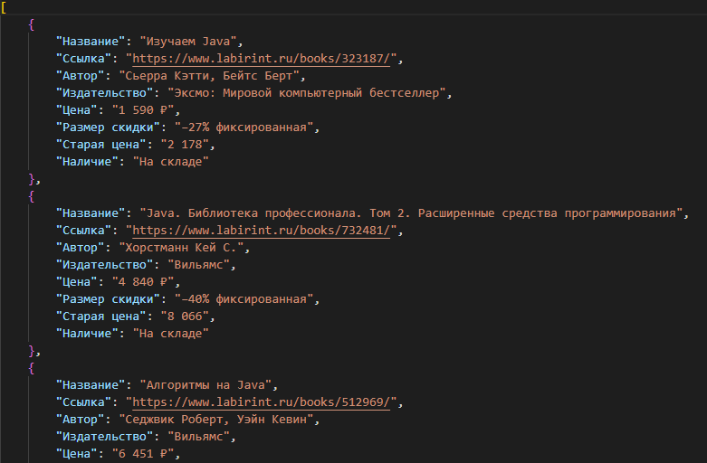
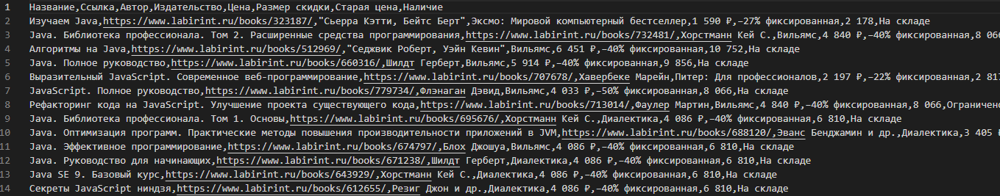
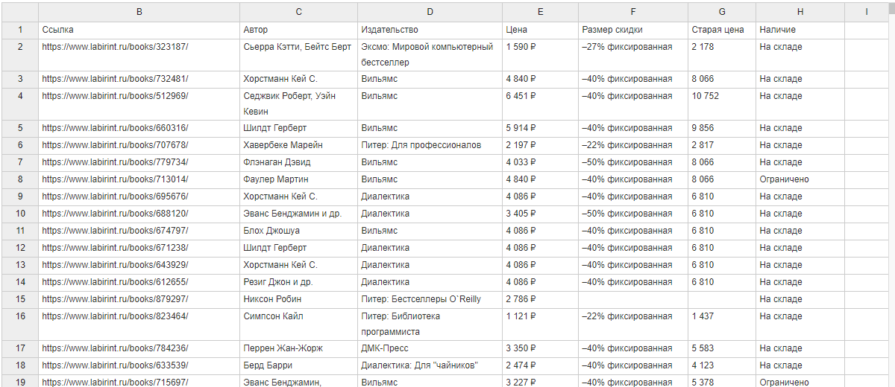

# Парсер книг с сайта labirint.ru по названию книги
Настройки указываются в верхей части файла main.py
```
# ---------------- Конфигурация ----------------
QUERY = 'java' # Поисковый запрос
THREAD_COUNT = 5 # Количество потоков для загрузки страниц
TEMP_PATH = 'temp' # Название папки для временного хранения html страниц
# ----------------------------------------------
```
Скрипт ищет книги по заданному запросу. Страницы с книгами сохраняются во временную папку используя многопоточность. Далее скрипт собирает все книги со всех страниц и сохраняет в файл json и csv.  
Временная папка будет удалена после завершения программы.  
Все зависимости в requirements.txt  

## Скриншоты
1. Консоль во время выполнения программы:  
  
---
1. Результат выполнения программы json  
  
---
1. Результат выполнения программы csv  
  
---
1. CSV файл через online reader  
  